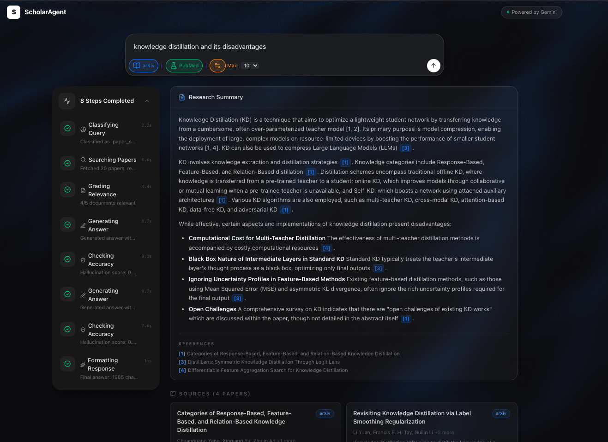

# ScholarAgent -- Agentic RAG Research Assistant


An intelligent research assistant that searches arXiv and PubMed, retrieves relevant papers, and generates cited answers using a 7-node agentic RAG pipeline built with LangGraph.



---

## Architecture

```
Query --> Router --> Retriever --> Grader --(relevant)--> Generator --> Hallucination Checker --> Synthesizer --> Response
                                    |                        ^
                                    |(irrelevant)            |
                                    v                        |
                                 Rewriter -------------------+
                              (max 2 retries)
```

| Node | Responsibility |
|------|---------------|
| **Router** | Classifies the query as `paper_search` or `general` conversation |
| **Retriever** | Fetches papers from arXiv/PubMed, embeds them in ChromaDB, retrieves top-k |
| **Grader** | LLM judges each document for relevance to the query |
| **Rewriter** | Rewrites the query with better keywords if grading fails (up to 2 retries) |
| **Generator** | Produces a cited answer grounded in the graded documents |
| **Hallucination Checker** | Scores answer groundedness (0.0-1.0); retries generation if hallucinated |
| **Synthesizer** | Cleans citations, removes dangling references, finalizes the response |

---

## Features

- **Multi-source search** -- Parallel queries to arXiv and PubMed with merged results
- **Agentic RAG pipeline** -- 7-node LangGraph state machine with conditional routing
- **Self-correcting** -- Automatic query rewriting when retrieved papers are irrelevant
- **Hallucination detection** -- LLM-based grounding check with configurable threshold
- **Real-time streaming** -- WebSocket endpoint streams agent steps to the frontend
- **3-model cascade** -- Gemini 2.5 Flash → 2.0 Flash → 2.0 Flash-Lite with automatic failover on rate limits
- **Vector search** -- ChromaDB with HuggingFace sentence-transformers embeddings
- **Inline citations** -- Answer references papers as [1], [2], etc. with URLs

---

## Tech Stack

| Layer | Technology |
|-------|-----------|
| **Agent Framework** | LangGraph (state machine with conditional edges) |
| **LLM** | Google Gemini 2.5 Flash (primary) / 2.0 Flash / 2.0 Flash-Lite (cascade fallback) |
| **Embeddings** | HuggingFace `all-MiniLM-L6-v2` (sentence-transformers) |
| **Vector Store** | ChromaDB (persistent, local) |
| **Backend** | FastAPI, uvicorn, httpx, arxiv library |
| **Frontend** | Next.js 14, TypeScript, Tailwind CSS, shadcn/ui |
| **Data Sources** | arXiv API, PubMed E-utilities (NCBI) |
| **CI/CD** | GitHub Actions (Python 3.11/3.12 matrix + Node 20) |
| **Containerization** | Docker, Docker Compose |

---

## Quick Start

### Option 1: Docker Compose (recommended)

```bash
# Clone the repository
git clone https://github.com/shinegami-2002/scholar-agent.git
cd scholar-agent

# Create environment file
cp backend/.env.example .env
# Edit .env and add your GOOGLE_API_KEY

# Start both services
docker compose up --build
```

The frontend will be available at `http://localhost:3000` and the API at `http://localhost:8000`.

### Option 2: Manual Setup

**Backend:**

```bash
cd backend
python -m venv .venv
source .venv/bin/activate    # Windows: .venv\Scripts\activate
pip install -e ".[dev]"

# Create .env file
cp .env.example .env
# Edit .env and add your GOOGLE_API_KEY

uvicorn app.main:app --reload
```

**Frontend:**

```bash
cd frontend
npm install
npm run dev
```

---

## Environment Variables

| Variable | Required | Description |
|----------|----------|-------------|
| `GOOGLE_API_KEY` | Yes | Google Gemini API key ([get one free](https://aistudio.google.com)) |
| `CHROMA_PERSIST_DIR` | No | ChromaDB storage path (default: `./data/chroma`) |
| `LLM_TEMPERATURE` | No | LLM temperature (default: `0.1`) |
| `MAX_PAPERS` | No | Papers per source (default: `10`) |
| `TOP_K_RESULTS` | No | Vector search top-k (default: `5`) |

---

## API Endpoints

### `GET /health`

Health check endpoint.

```json
{ "status": "healthy", "service": "scholar-agent" }
```

### `POST /api/search`

Run the full agent pipeline.

**Request:**
```json
{
  "query": "transformer architecture for protein folding",
  "sources": ["arxiv", "pubmed"],
  "max_results": 10
}
```

**Response:**
```json
{
  "query": "transformer architecture for protein folding",
  "answer": "Recent research has demonstrated that transformer architectures... [1] [2]",
  "citations": [
    { "index": 1, "title": "AlphaFold2...", "url": "https://arxiv.org/abs/..." }
  ],
  "papers": [...],
  "steps": [
    { "node": "router", "status": "completed", "detail": "paper_search", "duration_ms": 120 }
  ],
  "rewrite_count": 0
}
```

### `WebSocket /ws/search`

Stream agent execution steps in real time. Send a `SearchRequest` JSON; receive `{"type": "step", "data": {...}}` messages followed by a final `{"type": "result", "data": {...}}`.

---

## Running Tests

```bash
cd backend
pip install -e ".[dev]"
pytest --tb=short -q
```

Lint:

```bash
ruff check app/ tests/
```

---

## Project Structure

```
scholar-agent/
|-- backend/
|   |-- app/
|   |   |-- agents/
|   |   |   |-- nodes/
|   |   |   |   |-- router.py          # Query classifier
|   |   |   |   |-- retriever.py       # Paper fetcher + vector indexing
|   |   |   |   |-- grader.py          # Relevance grading
|   |   |   |   |-- rewriter.py        # Query rewriting
|   |   |   |   |-- generator.py       # Answer generation with citations
|   |   |   |   |-- hallucination_checker.py
|   |   |   |   |-- synthesizer.py     # Final response cleanup
|   |   |   |-- graph.py               # LangGraph state machine
|   |   |   |-- state.py               # AgentState TypedDict
|   |   |-- models/
|   |   |   |-- schemas.py             # Pydantic models
|   |   |-- services/
|   |   |   |-- paper_fetcher.py       # arXiv + PubMed clients
|   |   |   |-- vector_store.py        # ChromaDB wrapper
|   |   |   |-- llm_provider.py        # Gemini/Groq factory
|   |   |   |-- embeddings.py          # HuggingFace embeddings
|   |   |-- config.py                  # Settings from env
|   |   |-- main.py                    # FastAPI app
|   |-- tests/                         # pytest test suite
|   |-- pyproject.toml
|   |-- Dockerfile
|-- frontend/
|   |-- app/                           # Next.js 14 app router
|   |-- components/
|   |   |-- search-bar.tsx             # AI prompt-style search input
|   |   |-- thinking-steps.tsx         # Collapsible agent pipeline viewer
|   |   |-- answer-panel.tsx           # Markdown answer with citations
|   |   |-- source-list.tsx            # Paper result cards grid
|   |   |-- header.tsx                 # Navigation header
|   |   |-- ui/                        # shadcn/ui + custom components
|   |-- lib/
|   |   |-- api.ts                     # Typed API client
|   |   |-- types.ts                   # TypeScript interfaces
|   |-- Dockerfile
|   |-- package.json
|-- docker-compose.yml
|-- .github/workflows/ci.yml
|-- README.md
```

---

## License

MIT
